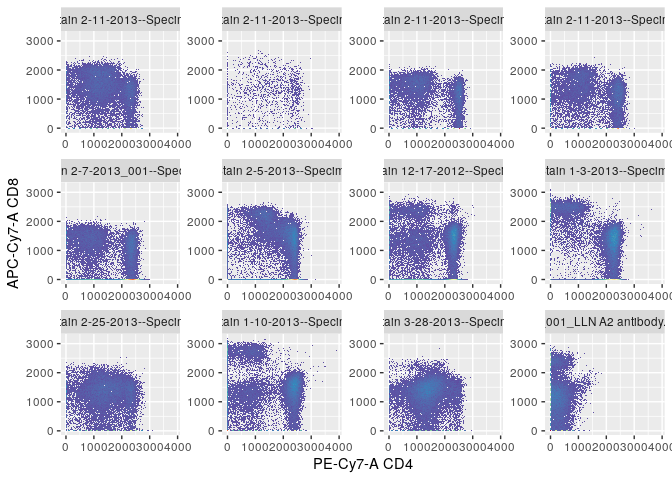

immdonor
================

Immdonor is a [GraphQL API](https://graphql.org/) of
[Immport](https://www.immport.org/) Organ Donor metadata hosted on
[Hasura Cloud](https://hasura.io/). This API lets you request exactly
what data you need from the [Immport data
model](https://www.immport.org/shared/dataModel) and returns a JSON
output which can be converted to a R dataframe\!

🚩This is a fast and easy way to link [Flow Cytometry Standard
(.FCS)](https://en.wikipedia.org/wiki/Flow_Cytometry_Standard) files to
their metadata for more robust analysis with
[Cytoverse](https://cytoverse.org/). You will need to have the FCS files
saved locally (see quick\_fetch.R).

## Connect to API

``` r
library(ghql)

#By connecting to this API you agree to the Immport.org Terms of Service
con <- GraphqlClient$new(url = "https://resolved-lab-57.hasura.app/v1/graphql")
```

-----

#### GET

``` r
qry <- Query$new()

studies<- qry$query('studies','{
  shared_data_study {
    study_accession
    actual_enrollment
    minimum_age
    maximum_age
  }
}')
x <- con$exec(qry$queries$studies)
```

#### ANSWER

``` r
studies<- as.data.frame (jsonlite::fromJSON(x))
```

<table>

<thead>

<tr>

<th style="text-align:left;">

study\_accession

</th>

<th style="text-align:right;">

actual\_enrollment

</th>

<th style="text-align:left;">

minimum\_age

</th>

<th style="text-align:left;">

maximum\_age

</th>

</tr>

</thead>

<tbody>

<tr>

<td style="text-align:left;">

SDY702

</td>

<td style="text-align:right;">

56

</td>

<td style="text-align:left;">

3.00

</td>

<td style="text-align:left;">

73.00

</td>

</tr>

<tr>

<td style="text-align:left;">

SDY1041

</td>

<td style="text-align:right;">

20

</td>

<td style="text-align:left;">

21.00

</td>

<td style="text-align:left;">

70.00

</td>

</tr>

<tr>

<td style="text-align:left;">

SDY1097

</td>

<td style="text-align:right;">

43

</td>

<td style="text-align:left;">

.20

</td>

<td style="text-align:left;">

63.00

</td>

</tr>

<tr>

<td style="text-align:left;">

SDY1389

</td>

<td style="text-align:right;">

51

</td>

<td style="text-align:left;">

9.00

</td>

<td style="text-align:left;">

76.00

</td>

</tr>

</tbody>

</table>

-----

## Organ Donor Metadata

The studies listed above feature cytometry data generously donated by
organ donors. We can build queries to return exactly what metadata we
would like to know about these organ donors.

``` r
qry <- Query$new()

files<- qry$query('files','{
  resultFiles {
    filePath
    studyAccession
    subjectAccession
    maxSubjectAge
    gender
    biosampleType
    parameters
    panel_id
    markers
    
  }
}')

x <- con$exec(qry$queries$files)
files<- as.data.frame (jsonlite::fromJSON(x))
```

### Biosample types

<table class="kable_wrapper">

<tbody>

<tr>

<td>

<table>

<thead>

<tr>

<th style="text-align:left;">

Primary Lymphoid Organs

</th>

<th style="text-align:right;">

Count

</th>

</tr>

</thead>

<tbody>

<tr>

<td style="text-align:left;">

Bone Marrow

</td>

<td style="text-align:right;">

150

</td>

</tr>

<tr>

<td style="text-align:left;">

Thymus

</td>

<td style="text-align:right;">

31

</td>

</tr>

</tbody>

</table>

</td>

<td>

<table>

<thead>

<tr>

<th style="text-align:left;">

Secondary Lymphoid Organs

</th>

<th style="text-align:right;">

Count

</th>

</tr>

</thead>

<tbody>

<tr>

<td style="text-align:left;">

Inguinal lymph node

</td>

<td style="text-align:right;">

102

</td>

</tr>

<tr>

<td style="text-align:left;">

Lung lymph node

</td>

<td style="text-align:right;">

246

</td>

</tr>

<tr>

<td style="text-align:left;">

Mesenteric lymph node

</td>

<td style="text-align:right;">

120

</td>

</tr>

<tr>

<td style="text-align:left;">

Spleen

</td>

<td style="text-align:right;">

182

</td>

</tr>

<tr>

<td style="text-align:left;">

Tonsil

</td>

<td style="text-align:right;">

12

</td>

</tr>

</tbody>

</table>

</td>

<td>

<table>

<thead>

<tr>

<th style="text-align:left;">

Mucosal

</th>

<th style="text-align:right;">

Count

</th>

</tr>

</thead>

<tbody>

<tr>

<td style="text-align:left;">

Colon

</td>

<td style="text-align:right;">

76

</td>

</tr>

<tr>

<td style="text-align:left;">

Ileum

</td>

<td style="text-align:right;">

61

</td>

</tr>

<tr>

<td style="text-align:left;">

Jejunum

</td>

<td style="text-align:right;">

58

</td>

</tr>

<tr>

<td style="text-align:left;">

Lung

</td>

<td style="text-align:right;">

130

</td>

</tr>

<tr>

<td style="text-align:left;">

PBMC

</td>

<td style="text-align:right;">

136

</td>

</tr>

<tr>

<td style="text-align:left;">

Whole blood

</td>

<td style="text-align:right;">

31

</td>

</tr>

</tbody>

</table>

</td>

</tr>

</tbody>

</table>

### Panels

Here are the top 5 staining panels with the most biosamples

<table>

<thead>

<tr>

<th style="text-align:left;">

panel\_id

</th>

<th style="text-align:right;">

parameters

</th>

<th style="text-align:left;">

markers

</th>

<th style="text-align:right;">

n

</th>

</tr>

</thead>

<tbody>

<tr>

<td style="text-align:left;">

FCM-19

</td>

<td style="text-align:right;">

14

</td>

<td style="text-align:left;">

FITC-A-CD25|Qdot 605-A-CD45RA|Qdot 655-A-CD3|QDot
705-A-CD127|APC-A-CD19|PE-Cy7-A-CD4|PE-A-FOXP3

</td>

<td style="text-align:right;">

81

</td>

</tr>

<tr>

<td style="text-align:left;">

FCM-56

</td>

<td style="text-align:right;">

20

</td>

<td style="text-align:left;">

APC-A-CMV|BV570-A-CD3|Qdot 655-A-CD4|Qdot 605 UV-A-CD8|Qdot
605-A-CD45RA|Alexa Fluor 488-A-CCR7|QDot 705-A-NA|BV421-A-CD95|Alexa
Fluor 700-A-INFg|PerCP-Cy5-5-A-TNFa|PE-Cy7-A-IL2|PE-A-CD107a|DAPI-A-DEAD

</td>

<td style="text-align:right;">

78

</td>

</tr>

<tr>

<td style="text-align:left;">

FCM-21

</td>

<td style="text-align:right;">

18

</td>

<td style="text-align:left;">

FITC-A-CD25|PE-Cy5-A-CTLA-4|BV421-A-CD69|Qdot 605-A-CD45RA|Qdot
655-A-CD3|QDot 705-A-CD127|APC-A-CD103|Alexa Fluor
700-A-KI67|APC-Cy7-A-CD8|PE-Cy7-A-CD4|PE-A-FOX-p3

</td>

<td style="text-align:right;">

57

</td>

</tr>

<tr>

<td style="text-align:left;">

FCM-1

</td>

<td style="text-align:right;">

14

</td>

<td style="text-align:left;">

Alexa Fluor 488-A-CCR7|PerCP-Cy5-5-A-CD45RO|BV421-A-CD69|Qdot
605-A-CD45RA|Qdot 655-A-CD3|QDot
705-A-CD127|APC-A-CD31|APC-Cy7-A-CD8|PE-Texas
Red-A-CD19|PE-Cy7-A-CD4|PE-A-CD28

</td>

<td style="text-align:right;">

54

</td>

</tr>

<tr>

<td style="text-align:left;">

FCM-2

</td>

<td style="text-align:right;">

18

</td>

<td style="text-align:left;">

Alexa Fluor 488-A-CCR7|PerCP-Cy5-5-A-CD45RO|BV421-A-CD69|Qdot
605-A-CD45RA|Qdot 655-A-CD3|QDot 705-A-CD127|APC-A-CD31|APC-Cy7-A-CD8|PE
Alexa Fluor 610-A-CD19|PE-Cy7-A-CD4|PE-A-CD28

</td>

<td style="text-align:right;">

52

</td>

</tr>

</tbody>

</table>

-----

## T Cell Analysis

<table>

<thead>

<tr>

<th style="text-align:left;">

panel\_id

</th>

<th style="text-align:right;">

parameters

</th>

<th style="text-align:left;">

markers

</th>

<th style="text-align:right;">

n

</th>

</tr>

</thead>

<tbody>

<tr>

<td style="text-align:left;">

FCM-2

</td>

<td style="text-align:right;">

18

</td>

<td style="text-align:left;">

Alexa Fluor 488-A-CCR7|PerCP-Cy5-5-A-CD45RO|BV421-A-CD69|Qdot
605-A-CD45RA|Qdot 655-A-CD3|QDot 705-A-CD127|APC-A-CD31|APC-Cy7-A-CD8|PE
Alexa Fluor 610-A-CD19|PE-Cy7-A-CD4|PE-A-CD28

</td>

<td style="text-align:right;">

52

</td>

</tr>

<tr>

<td style="text-align:left;">

FCM-3

</td>

<td style="text-align:right;">

18

</td>

<td style="text-align:left;">

Alexa Fluor 488-A-NA|PerCP-Cy5-5-A-NA|BV421-A-NA|Qdot 605-A-NA|Qdot
655-A-NA|QDot 705-A-NA|APC-A-NA|APC-Cy7-A-NA|PE Alexa Fluor
610-A-NA|PE-Cy7-A-NA|PE-A-NA

</td>

<td style="text-align:right;">

27

</td>

</tr>

</tbody>

</table>

### Link cytoset to metadata

``` r
# Load cytoset 
fcs<- files %>% filter(data.resultFiles.panel_id == "FCM-2"|data.resultFiles.panel_id == "FCM-3")
fn<- fcs$data.resultFiles.filePath
cs<- load_cytoset_from_fcs(files = fn)

#link immdonor metadata to pData
p<- pData(cs)
m<- cbind(p,fcs)
pData(cs)<- m

# Harmonize marker names
channels <- colnames(cs)
markers <- as.vector(pData(parameters(cs[[1]]))$desc)
names(markers)<- channels
markernames(cs) <- markers
```

### Compensate and Transform

``` r
# Apply file internal compensation
comps <- lapply(cs, function(cf) spillover(cf)$SPILL)
cs_comp <- compensate(cs, comps)

# Transform fluorescent channels with FCSTrans
channels_to_exclude <- c(grep(colnames(cs), pattern="FSC"),
                         grep(colnames(cs), pattern="SSC"),
                         grep(colnames(cs), pattern="Time"))
chnls <- colnames(cs)[-channels_to_exclude]

fcstrans<- FCSTransTransform(transformationId = "defaultFCSTransTransform", channelrange = 2^18, channeldecade = 4.5, range = 4096, cutoff = -111, w = 0.5, rescale = TRUE)
transList <- transformList(chnls, fcstrans)

cs_trans<- transform(cs_comp,transList)

cs<- save_cytoset(cs_trans, "cytosets/tcell)
```

### Build Autogating strategy

``` r
cs<- load_cytoset(path = "cytosets/tcell")
gs<- GatingSet(cs)

gs_add_gating_method(gs, alias = "nonDebris",
                     pop = "+",
                     parent = "root",
                     dims = "FSC-A",
                     gating_method = "mindensity",
                     gating_args = "min = 20000, max=50000",
                     collapseDataForGating = "TRUE",
                     groupBy = "data.resultFiles.biosampleType") 
## ...
## Warning in .gating_gtMethod(x, y, ...): NAs introduced by coercion
## done

gs_add_gating_method(gs, alias = "singlets",
                     pop = "+",
                     parent = "nonDebris",
                     dims = "FSC-A,FSC-H",
                     gating_method = "singletGate")
## ...
## done

gs_add_gating_method(gs, alias = "CD19",
                     pop = "+/-",
                     parent = "singlets",
                     dims = "CD19",
                     gating_method = "mindensity",
                     gating_args = "min = 1700, max=3000",
                     collapseDataForGating = "TRUE",
                     groupBy = "data.resultFiles.biosampleType")
## ...
## Warning in .gating_gtMethod(x, y, ...): NAs introduced by coercion
## done


lln<- subset(gs, data.resultFiles.biosampleType == "Lung lymph node")
lung<- subset(gs, data.resultFiles.biosampleType == "Lung")
spleen<- subset(gs, data.resultFiles.biosampleType == "Spleen")


ggcyto(gs_pop_get_data(lln ,"CD19-"), aes(x = "CD4", y = "CD8")) + geom_hex(bins = 128)
```

<!-- -->

  - Coming soon:
      - Metacyto analysis
      - opencyto gating
      - CyTOF data support
  - Please contact me with ANY questions, comments or suggestions\!\!\!
      - Slack: Join the [immunespace
        slack\!](https://immunespace.slack.com/archives/DFU59KGUD)
      - Discord: MRJ\#0408
      - email: mrjaffery at gmail dot com
