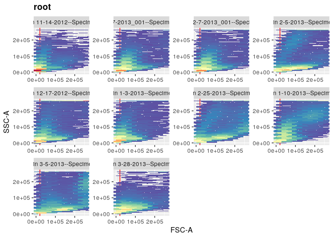

immdonor
================

Installation

``` r
devtools::install_github("mrj31/immdonor")
```

Search for donors in SDY702 and SDY1097

``` r
SDY702<- donor_search(study = "SDY702")
SDY1097<- donor_search(study = "SDY1097")
```

Parse fcs headers

``` r
meta<- rbind(SDY702,SDY1097)
donormeta<- panel_parser(donorMeta = meta)
```

    ## Parsing Donor List

    ##  [1] "SUB165857" "SUB165859" "SUB165860" "SUB165861" "SUB165862" "SUB165863"
    ##  [7] "SUB165865" "SUB165867" "SUB165873" "SUB165874" "SUB165875" "SUB165876"
    ## [13] "SUB165878" "SUB165879" "SUB165880" "SUB165881" "SUB165882" "SUB165883"
    ## [19] "SUB165888" "SUB165889" "SUB165897" "SUB165898" "SUB165900" "SUB165902"
    ## [25] "SUB165907" "SUB165909" "SUB165890" "SUB165892" "SUB165893" "SUB165901"
    ## [31] "SUB165903" "SUB165894" "SUB165896" "SUB165904" "SUB165905" "SUB165856"
    ## [37] "SUB165864" "SUB165866" "SUB165868" "SUB165869" "SUB165870" "SUB165871"
    ## [43] "SUB179016" "SUB165899" "SUB179017" "SUB179018" "SUB179019" "SUB179020"
    ## [49] "SUB179021" "SUB165906" "SUB179022" "SUB179023" "SUB179024" "SUB179025"
    ## [55] "SUB179026" "SUB179027" "SUB177521" "SUB179028" "SUB179029" "SUB179030"
    ## [61] "SUB179031" "SUB179032" "SUB177530" "SUB179033" "SUB179008" "SUB179034"
    ## [67] "SUB179035" "SUB179009" "SUB179010" "SUB179011" "SUB165877" "SUB179012"
    ## [73] "SUB179013" "SUB179014" "SUB179015"

    ## # A tibble: 11 x 2
    ## # Groups:   biosampleType [11]
    ##    biosampleType             n
    ##    <chr>                 <int>
    ##  1 Colon                    59
    ##  2 Ileum                    61
    ##  3 Inguinal lymph node      61
    ##  4 Jejunum                  58
    ##  5 Lung                     69
    ##  6 Lung lymph node          81
    ##  7 Mesenteric lymph node    74
    ##  8 PBMC                     46
    ##  9 Spleen                   90
    ## 10 Thymus                   29
    ## 11 Whole blood              31

Preprocess

``` r
preprocessing.batch(inputMeta = fcs_info,
                    assay = "FCM",
                    outpath = "metacyto/2052/preprocess_output",
                    b = 1/150,
                    excludeTransformParameters=c("FSC-A","FSC-W","FSC-H","SSC-A","SSC-W","SSC-H","Time"))
```

    ## Warning in dir.create(outpath, recursive = TRUE): 'metacyto/2052/
    ## preprocess_output' already exists

    ## Study ID =  Colon  Preprocessing 
    ## Study ID =  Ileum  Preprocessing 
    ## Study ID =  Mesenteric lymph node  Preprocessing 
    ## Study ID =  Jejunum  Preprocessing 
    ## Study ID =  Whole blood  Preprocessing 
    ## Study ID =  Lung lymph node  Preprocessing 
    ## Study ID =  Inguinal lymph node  Preprocessing 
    ## Study ID =  Lung  Preprocessing 
    ## Study ID =  Spleen  Preprocessing 
    ## Study ID =  Thymus  Preprocessing 
    ## Study ID =  PBMC  Preprocessing 
    ## Preprocess result stored in the folder: metacyto/2052/preprocess_output

Identify and Label clusters

``` r
#define parameters that we don't want to cluster
excludeClusterParameters=c("FSC-A","FSC-W","FSC-H","SSC-A","SSC-W","SSC-H","Time")

cluster_label=autoCluster.batch(preprocessOutputFolder="metacyto/2052/preprocess_output",
                                excludeClusterParameters=excludeClusterParameters,
                                labelQuantile=0.95,
                                minPercent = 0.05,
                                clusterFunction=flowSOM.MC)
```

    ## Clustering , study ID =  Colon

    ## Building SOM

    ## Mapping data to SOM

    ## Building MST

    ## Clustering , study ID =  Ileum

    ## Building SOM

    ## Mapping data to SOM

    ## Building MST

    ## Clustering , study ID =  Mesenteric lymph node

    ## Building SOM

    ## Mapping data to SOM

    ## Building MST

    ## Clustering , study ID =  Jejunum

    ## Building SOM

    ## Mapping data to SOM

    ## Building MST

    ## Clustering , study ID =  Whole blood

    ## Building SOM

    ## Mapping data to SOM

    ## Building MST

    ## Clustering , study ID =  Lung lymph node

    ## Building SOM

    ## Mapping data to SOM

    ## Building MST

    ## Clustering , study ID =  Inguinal lymph node

    ## Building SOM

    ## Mapping data to SOM

    ## Building MST

    ## Clustering , study ID =  Lung

    ## Building SOM

    ## Mapping data to SOM

    ## Building MST

    ## Clustering , study ID =  Spleen

    ## Building SOM

    ## Mapping data to SOM

    ## Building MST

    ## Clustering , study ID =  Thymus

    ## Building SOM

    ## Mapping data to SOM

    ## Building MST

    ## Clustering , study ID =  PBMC

    ## Building SOM

    ## Mapping data to SOM

    ## Building MST

Search for
clusters

``` r
searchCluster.batch(preprocessOutputFolder="metacyto/2052/preprocess_output",
                    outpath="metacyto/2052/search_output",
                    clusterLabel=cluster_label)
```

    ## Searching , study ID =  Colon

    ## Searching , study ID =  Ileum

    ## Searching , study ID =  Mesenteric lymph node

    ## Searching , study ID =  Jejunum

    ## Searching , study ID =  Whole blood

    ## Searching , study ID =  Lung lymph node

    ## Searching , study ID =  Inguinal lymph node

    ## Searching , study ID =  Lung

    ## Searching , study ID =  Spleen

    ## Searching , study ID =  Thymus

    ## Searching , study ID =  PBMC

General Analysis

``` r
# Collect Summary statistics generated in step 3
files=list.files("metacyto/2052/search_output",pattern="cluster_stats_in_each_sample",recursive=TRUE,full.names=TRUE)
fcs_stats=collectData(files,longform=TRUE)

# join the cluster summary statistics with sample information
all_data=inner_join(fcs_stats,sample_info,by="fcs_files")

# See the fraction of what clusters are affected by age (while controlling for Gender)
GA=glmAnalysis(value="value",variableOfInterst="maxSubjectAge",parameter="fraction",
               otherVariables=c("gender"),studyID="study_id",label="label",
               data=all_data,CILevel=0.95,ifScale=c(TRUE,FALSE))
GA=GA[order(GA$Effect_size),]

GA$label=as.character(GA$label)
w = which(nchar(GA$label)<30)
GA = GA[w,]

# plot the results
plotGA(GA, size = 8)
```

    ## Warning: Use of `GA$label` is discouraged. Use `label` instead.

    ## Warning: Use of `GA$Effect_size` is discouraged. Use `Effect_size` instead.

<!-- -->
