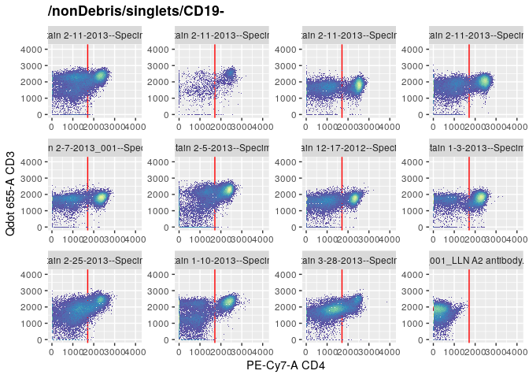

immdonor
================

Immdonor is a [GraphQL API](https://graphql.org/) of
[Immport](https://www.immport.org/) Organ Donor metadata hosted on
[Hasura Cloud](https://hasura.io/). This API lets you request exactly
what data you need from the [Immport data
model](https://www.immport.org/shared/dataModel) and returns a JSON
output which can be converted to a R dataframe\!

🔥This is a fast way to link [Flow Cytometry Standard
(.FCS)](https://en.wikipedia.org/wiki/Flow_Cytometry_Standard) files to
their metadata and enables more robust analysis with
[Cytoverse](https://cytoverse.org/). You will need to have the FCS files
saved locally (see quick\_fetch.R).

## Connect to API

You can connect using your preferred GraphQL R client. Here we use
[rOpenSci’s ghql package](https://github.com/ropensci/ghql)

``` r
library(ghql)

#By connecting to this API you agree to the Immport.org Terms of Service
con <- GraphqlClient$new(url = "https://resolved-lab-57.hasura.app/v1/graphql")
```

-----

#### GET

``` r
qry <- Query$new()

studies<- qry$query('studies','{
  shared_data_study {
    study_accession
    actual_enrollment
    minimum_age
    maximum_age
  }
}')
x <- con$exec(qry$queries$studies)
```

#### ANSWER

``` r
studies<- as.data.frame (jsonlite::fromJSON(x))
```

<table>

<thead>

<tr>

<th style="text-align:left;">

study\_accession

</th>

<th style="text-align:right;">

actual\_enrollment

</th>

<th style="text-align:left;">

minimum\_age

</th>

<th style="text-align:left;">

maximum\_age

</th>

</tr>

</thead>

<tbody>

<tr>

<td style="text-align:left;">

SDY702

</td>

<td style="text-align:right;">

56

</td>

<td style="text-align:left;">

3.00

</td>

<td style="text-align:left;">

73.00

</td>

</tr>

<tr>

<td style="text-align:left;">

SDY1041

</td>

<td style="text-align:right;">

20

</td>

<td style="text-align:left;">

21.00

</td>

<td style="text-align:left;">

70.00

</td>

</tr>

<tr>

<td style="text-align:left;">

SDY1097

</td>

<td style="text-align:right;">

43

</td>

<td style="text-align:left;">

.20

</td>

<td style="text-align:left;">

63.00

</td>

</tr>

<tr>

<td style="text-align:left;">

SDY1389

</td>

<td style="text-align:right;">

51

</td>

<td style="text-align:left;">

9.00

</td>

<td style="text-align:left;">

76.00

</td>

</tr>

</tbody>

</table>

-----

## Organ Donor Metadata

The studies listed above feature cytometry data generously donated by
organ donors. We can build queries to return exactly what metadata we
would like to know about these organ donors.

``` r
qry <- Query$new()

files<- qry$query('files','{
  resultFiles {
    filePath
    studyAccession
    subjectAccession
    maxSubjectAge
    gender
    biosampleType
    parameters
    panel_id
    markers
    
  }
}')

x <- con$exec(qry$queries$files)
files<- as.data.frame (jsonlite::fromJSON(x))
```

### Biosample types

<table class="kable_wrapper">

<tbody>

<tr>

<td>

<table>

<thead>

<tr>

<th style="text-align:left;">

Primary Lymphoid Organs

</th>

<th style="text-align:right;">

Count

</th>

</tr>

</thead>

<tbody>

<tr>

<td style="text-align:left;">

Bone Marrow

</td>

<td style="text-align:right;">

150

</td>

</tr>

<tr>

<td style="text-align:left;">

Thymus

</td>

<td style="text-align:right;">

31

</td>

</tr>

</tbody>

</table>

</td>

<td>

<table>

<thead>

<tr>

<th style="text-align:left;">

Secondary Lymphoid Organs

</th>

<th style="text-align:right;">

Count

</th>

</tr>

</thead>

<tbody>

<tr>

<td style="text-align:left;">

Inguinal lymph node

</td>

<td style="text-align:right;">

102

</td>

</tr>

<tr>

<td style="text-align:left;">

Lung lymph node

</td>

<td style="text-align:right;">

246

</td>

</tr>

<tr>

<td style="text-align:left;">

Mesenteric lymph node

</td>

<td style="text-align:right;">

120

</td>

</tr>

<tr>

<td style="text-align:left;">

Spleen

</td>

<td style="text-align:right;">

182

</td>

</tr>

<tr>

<td style="text-align:left;">

Tonsil

</td>

<td style="text-align:right;">

12

</td>

</tr>

</tbody>

</table>

</td>

<td>

<table>

<thead>

<tr>

<th style="text-align:left;">

Mucosal

</th>

<th style="text-align:right;">

Count

</th>

</tr>

</thead>

<tbody>

<tr>

<td style="text-align:left;">

Colon

</td>

<td style="text-align:right;">

76

</td>

</tr>

<tr>

<td style="text-align:left;">

Ileum

</td>

<td style="text-align:right;">

61

</td>

</tr>

<tr>

<td style="text-align:left;">

Jejunum

</td>

<td style="text-align:right;">

58

</td>

</tr>

<tr>

<td style="text-align:left;">

Lung

</td>

<td style="text-align:right;">

130

</td>

</tr>

<tr>

<td style="text-align:left;">

PBMC

</td>

<td style="text-align:right;">

136

</td>

</tr>

<tr>

<td style="text-align:left;">

Whole blood

</td>

<td style="text-align:right;">

31

</td>

</tr>

</tbody>

</table>

</td>

</tr>

</tbody>

</table>

### Panels

Here are the top 5 staining panels with the most biosamples

<table>

<thead>

<tr>

<th style="text-align:left;">

panel\_id

</th>

<th style="text-align:right;">

parameters

</th>

<th style="text-align:left;">

markers

</th>

<th style="text-align:right;">

n

</th>

</tr>

</thead>

<tbody>

<tr>

<td style="text-align:left;">

FCM-19

</td>

<td style="text-align:right;">

14

</td>

<td style="text-align:left;">

FITC-A-CD25|Qdot 605-A-CD45RA|Qdot 655-A-CD3|QDot
705-A-CD127|APC-A-CD19|PE-Cy7-A-CD4|PE-A-FOXP3

</td>

<td style="text-align:right;">

81

</td>

</tr>

<tr>

<td style="text-align:left;">

FCM-56

</td>

<td style="text-align:right;">

20

</td>

<td style="text-align:left;">

APC-A-CMV|BV570-A-CD3|Qdot 655-A-CD4|Qdot 605 UV-A-CD8|Qdot
605-A-CD45RA|Alexa Fluor 488-A-CCR7|QDot 705-A-NA|BV421-A-CD95|Alexa
Fluor 700-A-INFg|PerCP-Cy5-5-A-TNFa|PE-Cy7-A-IL2|PE-A-CD107a|DAPI-A-DEAD

</td>

<td style="text-align:right;">

78

</td>

</tr>

<tr>

<td style="text-align:left;">

FCM-21

</td>

<td style="text-align:right;">

18

</td>

<td style="text-align:left;">

FITC-A-CD25|PE-Cy5-A-CTLA-4|BV421-A-CD69|Qdot 605-A-CD45RA|Qdot
655-A-CD3|QDot 705-A-CD127|APC-A-CD103|Alexa Fluor
700-A-KI67|APC-Cy7-A-CD8|PE-Cy7-A-CD4|PE-A-FOX-p3

</td>

<td style="text-align:right;">

57

</td>

</tr>

<tr>

<td style="text-align:left;">

FCM-1

</td>

<td style="text-align:right;">

14

</td>

<td style="text-align:left;">

Alexa Fluor 488-A-CCR7|PerCP-Cy5-5-A-CD45RO|BV421-A-CD69|Qdot
605-A-CD45RA|Qdot 655-A-CD3|QDot
705-A-CD127|APC-A-CD31|APC-Cy7-A-CD8|PE-Texas
Red-A-CD19|PE-Cy7-A-CD4|PE-A-CD28

</td>

<td style="text-align:right;">

54

</td>

</tr>

<tr>

<td style="text-align:left;">

FCM-2

</td>

<td style="text-align:right;">

18

</td>

<td style="text-align:left;">

Alexa Fluor 488-A-CCR7|PerCP-Cy5-5-A-CD45RO|BV421-A-CD69|Qdot
605-A-CD45RA|Qdot 655-A-CD3|QDot 705-A-CD127|APC-A-CD31|APC-Cy7-A-CD8|PE
Alexa Fluor 610-A-CD19|PE-Cy7-A-CD4|PE-A-CD28

</td>

<td style="text-align:right;">

52

</td>

</tr>

</tbody>

</table>

-----

## T Cell Surface Panel Analysis

<table>

<thead>

<tr>

<th style="text-align:left;">

panel\_id

</th>

<th style="text-align:right;">

parameters

</th>

<th style="text-align:left;">

markers

</th>

<th style="text-align:right;">

n

</th>

</tr>

</thead>

<tbody>

<tr>

<td style="text-align:left;">

FCM-2

</td>

<td style="text-align:right;">

18

</td>

<td style="text-align:left;">

Alexa Fluor 488-A-CCR7|PerCP-Cy5-5-A-CD45RO|BV421-A-CD69|Qdot
605-A-CD45RA|Qdot 655-A-CD3|QDot 705-A-CD127|APC-A-CD31|APC-Cy7-A-CD8|PE
Alexa Fluor 610-A-CD19|PE-Cy7-A-CD4|PE-A-CD28

</td>

<td style="text-align:right;">

52

</td>

</tr>

<tr>

<td style="text-align:left;">

FCM-3

</td>

<td style="text-align:right;">

18

</td>

<td style="text-align:left;">

Alexa Fluor 488-A-NA|PerCP-Cy5-5-A-NA|BV421-A-NA|Qdot 605-A-NA|Qdot
655-A-NA|QDot 705-A-NA|APC-A-NA|APC-Cy7-A-NA|PE Alexa Fluor
610-A-NA|PE-Cy7-A-NA|PE-A-NA

</td>

<td style="text-align:right;">

27

</td>

</tr>

</tbody>

</table>

#### Link cytoset to metadata

In order to use all of OpenCyto’s features like `collapseDataForGating`
we need to annotate the donor metadata into the cytoset’s pData.

``` r
# Load cytoset 
fcs<- files %>% filter(data.resultFiles.panel_id == "FCM-2"|data.resultFiles.panel_id == "FCM-3")
fn<- fcs$data.resultFiles.filePath
cs<- load_cytoset_from_fcs(files = fn)

#Annotate immdonor metadata to pData
p<- pData(cs)
m<- cbind(p,fcs)
pData(cs)<- m

# Harmonize marker names
channels <- colnames(cs)
markers <- as.vector(pData(parameters(cs[[1]]))$desc)
names(markers)<- channels
markernames(cs) <- markers
```

#### Compensate and Transform

``` r
# Apply file internal compensation
comps <- lapply(cs, function(cf) spillover(cf)$SPILL)
cs_comp <- compensate(cs, comps)

# Transform fluorescent channels with FCSTrans
channels_to_exclude <- c(grep(colnames(cs), pattern="FSC"),
                         grep(colnames(cs), pattern="SSC"),
                         grep(colnames(cs), pattern="Time"))
chnls <- colnames(cs)[-channels_to_exclude]

fcstrans<- FCSTransTransform(transformationId = "defaultFCSTransTransform", channelrange = 2^18, channeldecade = 4.5, range = 4096, cutoff = -111, w = 0.5, rescale = TRUE)
transList <- transformList(chnls, fcstrans)

cs_trans<- transform(cs_comp,transList)

cs<- save_cytoset(cs_trans, "cytosets/tcell)
```

#### Build Autogating strategy

Since we annotated the cytoset with each file’s age, gender and
biosample type we can use the `collapseDataForGating` feature and
`groupby` biosampleType to improve our autogating.

``` r
cs<- load_cytoset(path = "cytosets/tcell")
gs<- GatingSet(cs)

gs_add_gating_method(gs, alias = "nonDebris",
                     pop = "+",
                     parent = "root",
                     dims = "FSC-A",
                     gating_method = "mindensity",
                     gating_args = "min = 20000, max=50000",
                     collapseDataForGating = "TRUE",
                     groupBy = "data.resultFiles.biosampleType") 
## ...
## Warning in .gating_gtMethod(x, y, ...): NAs introduced by coercion
## done

gs_add_gating_method(gs, alias = "singlets",
                     pop = "+",
                     parent = "nonDebris",
                     dims = "FSC-A,FSC-H",
                     gating_method = "singletGate")
## ...
## done


gs_add_gating_method(gs, alias = "bcells",
                     pop = "+/-",
                     parent = "singlets",
                     dims = "CD19",
                     gating_method = "mindensity",
                     collapseDataForGating = "TRUE",
                     groupBy = "data.resultFiles.biosampleType")
## ...
## Warning in .gating_gtMethod(x, y, ...): NAs introduced by coercion
## done

gs_add_gating_method(gs, alias = "CD4",
                     pop = "+/-+/-",
                     parent = "CD19-",
                     dims = "CD3,CD4",
                     gating_method = "mindensity",
                     gating_args = "min = 1500, max=2500",
                     collapseDataForGating = "TRUE",
                     groupBy = "data.resultFiles.biosampleType")
## ...
## Warning in .gating_gtMethod(x, y, ...): NAs introduced by coercion

## Warning in .gating_gtMethod(x, y, ...): NAs introduced by coercion
## done

gs_add_gating_method(gs, alias = "Tmem",
                     pop = "+/-+/-",
                     parent = "CD4+",
                     dims = "CCR7,CD45RA",
                     gating_method = "mindensity",
                     gating_args = "min = 1750, max=2500",
                     collapseDataForGating = "TRUE",
                     groupBy = "data.resultFiles.biosampleType")
## ...
## Warning in .gating_gtMethod(x, y, ...): NAs introduced by coercion

## Warning in .gating_gtMethod(x, y, ...): NAs introduced by coercion
## done


lln<- subset(gs, data.resultFiles.biosampleType == "Lung lymph node")
lung<- subset(gs, data.resultFiles.biosampleType == "Lung")
spleen<- subset(gs, data.resultFiles.biosampleType == "Spleen")
blood<- subset(gs, data.resultFiles.biosampleType == "Whole blood")
```

### CD3+CD4 T cells

Lung Lymph node

``` r
ggcyto(lln, aes(x = "CD4", y = "CD3")) + geom_gate("CD4+") + geom_hex(bins = 128)+ ggcyto_par_set(limits = "instrument")
## Coordinate system already present. Adding new coordinate system, which will replace the existing one.
```

<!-- -->

Lung

``` r
ggcyto(lung, aes(x = "CD4", y = "CD3")) + geom_gate("CD4+") + geom_hex(bins = 128)+ ggcyto_par_set(limits = "instrument")
## Coordinate system already present. Adding new coordinate system, which will replace the existing one.
```

<!-- -->

Spleen

``` r
ggcyto(spleen, aes(x = "CD4", y = "CD3")) + geom_gate("CD4+") + geom_hex(bins = 128)+ ggcyto_par_set(limits = "instrument")
## Coordinate system already present. Adding new coordinate system, which will replace the existing one.
```

<!-- -->

### CD4 memory subsets


Lung Lymph Node

``` r
ggcyto(gs_pop_get_data(lln ,"CD4+"), aes(x = "CCR7", y = "CD45RA")) + geom_hex(bins = 128)
```

<!-- -->

Lung

``` r
ggcyto(gs_pop_get_data(lung ,"CD4+"), aes(x = "CCR7", y = "CD45RA")) + geom_hex(bins = 128)
```

<!-- -->

Spleen

``` r
ggcyto(gs_pop_get_data(spleen ,"CD4+"), aes(x = "CCR7", y = "CD45RA")) + geom_hex(bins = 128)
```

<!-- -->

-----

## Metacyto analysis

work in progress…

``` r
fcs<- files %>% filter(data.resultFiles.panel_id == "FCM-2"|data.resultFiles.panel_id == "FCM-3")

fcs<- fcs %>%
  dplyr::filter(data.resultFiles.biosampleType == "Lung lymph node"|data.resultFiles.biosampleType == "Lung"|data.resultFiles.biosampleType == "Spleen"|data.resultFiles.biosampleType == "PBMC"|data.resultFiles.biosampleType == "Whole blood"|data.resultFiles.biosampleType == "Inguinal lymph node"|data.resultFiles.biosampleType == "Colon"|data.resultFiles.biosampleType == "Ileum"|data.resultFiles.biosampleType == "Jejunum")

fcs$fcs_files<- fcs$data.resultFiles.filePath
fcs$study_id <- fcs$data.resultFiles.biosampleType

fcs_info<- fcs %>% 
  dplyr::select(fcs_files, study_id)

sample_info <- fcs %>%
  dplyr::select(fcs_files, data.resultFiles.maxSubjectAge,data.resultFiles.biosampleType, data.resultFiles.gender)

preprocessing.batch(inputMeta = fcs_info,
                    assay = "FCM",
                    outpath = "metacyto/panel/preprocess_output",
                    b = 1/150,
                    excludeTransformParameters=c("FSC-A","FSC-W","FSC-H","SSC-A","SSC-W","SSC-H","Time"))
## Warning in dir.create(outpath, recursive = TRUE): 'metacyto/panel/
## preprocess_output' already exists
## Study ID =  Colon  Preprocessing 
## Study ID =  Ileum  Preprocessing 
## Study ID =  Jejunum  Preprocessing 
## Study ID =  Whole blood  Preprocessing 
## Study ID =  Lung lymph node  Preprocessing 
## Study ID =  Inguinal lymph node  Preprocessing 
## Study ID =  Lung  Preprocessing 
## Study ID =  Spleen  Preprocessing 
## Study ID =  PBMC  Preprocessing 
## Preprocess result stored in the folder: metacyto/panel/preprocess_output

files=list.files("metacyto/panel",pattern="processed_sample",recursive=TRUE,full.names=TRUE)

cs<- load_cytoset(path = "cytosets/tcell")
new<- markernames(cs)
channels_to_exclude <- c(grep(colnames(cs), pattern="FSC"),
                         grep(colnames(cs), pattern="SSC"),
                         grep(colnames(cs), pattern="Time"))
old <- colnames(cs)[-channels_to_exclude]
old<- toupper(old)
oldplus<-paste0(old,"+")
oldminus<-paste0(old,"-")

nameUpdator(oldNames=old, newNames=new, files=files)
nameUpdator(oldNames=oldplus, newNames=new, files=files)
nameUpdator(oldNames=oldminus, newNames=new, files=files)


#define parameters that we don't want to cluster
excludeClusterParameters=c("FSC-A","FSC-W","FSC-H","SSC-A","SSC-W","SSC-H","Time")

cluster_label=autoCluster.batch(preprocessOutputFolder="metacyto/panel/preprocess_output",
                                excludeClusterParameters=excludeClusterParameters,
                                labelQuantile=0.95,
                                minPercent = 0.05,
                                clusterFunction=flowSOM.MC)
## Clustering , study ID =  Colon
## Building SOM
## Mapping data to SOM
## Building MST
## Clustering , study ID =  Ileum
## Building SOM
## Mapping data to SOM
## Building MST
## Clustering , study ID =  Jejunum
## Building SOM
## Mapping data to SOM
## Building MST
## Clustering , study ID =  Whole blood
## Building SOM
## Mapping data to SOM
## Building MST
## Clustering , study ID =  Lung lymph node
## Building SOM
## Mapping data to SOM
## Building MST
## Clustering , study ID =  Inguinal lymph node
## Building SOM
## Mapping data to SOM
## Building MST
## Clustering , study ID =  Lung
## Building SOM
## Mapping data to SOM
## Building MST
## Clustering , study ID =  Spleen
## Building SOM
## Mapping data to SOM
## Building MST
## Clustering , study ID =  PBMC
## Building SOM
## Mapping data to SOM
## Building MST

searchCluster.batch(preprocessOutputFolder="metacyto/panel/preprocess_output",
                    outpath="metacyto/panel/search_output",
                    clusterLabel=cluster_label)
## Warning in dir.create(file.path(outpath), recursive = TRUE): 'metacyto/panel/
## search_output' already exists
## Searching , study ID =  Colon
## Warning in dir.create(file.path(outpath, std)): 'metacyto/panel/search_output/
## Colon' already exists
## Searching , study ID =  Ileum
## Warning in dir.create(file.path(outpath, std)): 'metacyto/panel/search_output/
## Ileum' already exists
## Searching , study ID =  Jejunum
## Warning in dir.create(file.path(outpath, std)): 'metacyto/panel/search_output/
## Jejunum' already exists
## Searching , study ID =  Whole blood
## Warning in dir.create(file.path(outpath, std)): 'metacyto/panel/search_output/
## Whole blood' already exists
## Searching , study ID =  Lung lymph node
## Warning in dir.create(file.path(outpath, std)): 'metacyto/panel/search_output/
## Lung lymph node' already exists
## Searching , study ID =  Inguinal lymph node
## Warning in dir.create(file.path(outpath, std)): 'metacyto/panel/search_output/
## Inguinal lymph node' already exists
## Searching , study ID =  Lung
## Warning in dir.create(file.path(outpath, std)): 'metacyto/panel/search_output/
## Lung' already exists
## Searching , study ID =  Spleen
## Warning in dir.create(file.path(outpath, std)): 'metacyto/panel/search_output/
## Spleen' already exists
## Searching , study ID =  PBMC
## Warning in dir.create(file.path(outpath, std)): 'metacyto/panel/search_output/
## PBMC' already exists

files=list.files("metacyto/panel/search_output",pattern="cluster_stats_in_each_sample",recursive=TRUE,full.names=TRUE)
fcs_stats=collectData(files,longform=TRUE)


# join the cluster summary statistics with sample information
all_data=inner_join(fcs_stats,sample_info,by="fcs_files")

# See the fraction of what clusters are affected by Gender (while controlling for age)
GA=glmAnalysis(value="value",
               variableOfInterst="data.resultFiles.gender",
               parameter="fraction", 
               otherVariables=c("data.resultFiles.maxSubjectAge"),
               studyID="study_id",label="label",
               data=all_data,CILevel=0.95,ifScale=c(TRUE,FALSE))

GA=GA[order(GA$`Effect_size`),]

GA$`label`=as.character(GA$`label`)
w = which((GA$`label`)>15)
```

    ## Warning: Use of `GA$label` is discouraged. Use `label` instead.

    ## Warning: Use of `GA$Effect_size` is discouraged. Use `Effect_size` instead.

<!-- -->

Top 20 largest effect size

<table>

<thead>

<tr>

<th style="text-align:left;">

</th>

<th style="text-align:left;">

label

</th>

<th style="text-align:right;">

Effect\_size

</th>

<th style="text-align:right;">

SE

</th>

<th style="text-align:right;">

t\_value

</th>

<th style="text-align:right;">

p\_value

</th>

<th style="text-align:right;">

lower

</th>

<th style="text-align:right;">

upper

</th>

<th style="text-align:right;">

N

</th>

</tr>

</thead>

<tbody>

<tr>

<td style="text-align:left;">

67

</td>

<td style="text-align:left;">

CCR7+|CD31+|CD4+|CD45RO+|CD8+

</td>

<td style="text-align:right;">

0.8158715

</td>

<td style="text-align:right;">

0.2421359

</td>

<td style="text-align:right;">

3.369478

</td>

<td style="text-align:right;">

0.0014412

</td>

<td style="text-align:right;">

0.3297635

</td>

<td style="text-align:right;">

1.3019796

</td>

<td style="text-align:right;">

61

</td>

</tr>

<tr>

<td style="text-align:left;">

185

</td>

<td style="text-align:left;">

CD4+|CD45RO+|CD8+

</td>

<td style="text-align:right;">

0.7900383

</td>

<td style="text-align:right;">

0.2411074

</td>

<td style="text-align:right;">

3.276707

</td>

<td style="text-align:right;">

0.0018933

</td>

<td style="text-align:right;">

0.3059950

</td>

<td style="text-align:right;">

1.2740816

</td>

<td style="text-align:right;">

61

</td>

</tr>

<tr>

<td style="text-align:left;">

60

</td>

<td style="text-align:left;">

CD28+|CD4+|CD45RO+

</td>

<td style="text-align:right;">

0.7750619

</td>

<td style="text-align:right;">

0.2346350

</td>

<td style="text-align:right;">

3.303267

</td>

<td style="text-align:right;">

0.0016843

</td>

<td style="text-align:right;">

0.3048429

</td>

<td style="text-align:right;">

1.2452809

</td>

<td style="text-align:right;">

66

</td>

</tr>

<tr>

<td style="text-align:left;">

79

</td>

<td style="text-align:left;">

CD28+|CD45RA+|CD45RO+|CD8+

</td>

<td style="text-align:right;">

0.7359716

</td>

<td style="text-align:right;">

0.2590835

</td>

<td style="text-align:right;">

2.840674

</td>

<td style="text-align:right;">

0.0064535

</td>

<td style="text-align:right;">

0.2158399

</td>

<td style="text-align:right;">

1.2561033

</td>

<td style="text-align:right;">

61

</td>

</tr>

<tr>

<td style="text-align:left;">

139

</td>

<td style="text-align:left;">

CD4+|CD45RO+

</td>

<td style="text-align:right;">

0.7225872

</td>

<td style="text-align:right;">

0.2341137

</td>

<td style="text-align:right;">

3.086479

</td>

<td style="text-align:right;">

0.0031694

</td>

<td style="text-align:right;">

0.2534128

</td>

<td style="text-align:right;">

1.1917615

</td>

<td style="text-align:right;">

66

</td>

</tr>

<tr>

<td style="text-align:left;">

81

</td>

<td style="text-align:left;">

CCR7+|CD31+|CD4+|CD45RO+

</td>

<td style="text-align:right;">

0.6679176

</td>

<td style="text-align:right;">

0.2530027

</td>

<td style="text-align:right;">

2.639962

</td>

<td style="text-align:right;">

0.0107685

</td>

<td style="text-align:right;">

0.1608888

</td>

<td style="text-align:right;">

1.1749463

</td>

<td style="text-align:right;">

66

</td>

</tr>

<tr>

<td style="text-align:left;">

87

</td>

<td style="text-align:left;">

CCR7+|CD28+|CD45RO+

</td>

<td style="text-align:right;">

0.6081179

</td>

<td style="text-align:right;">

0.2698959

</td>

<td style="text-align:right;">

2.253157

</td>

<td style="text-align:right;">

0.0282575

</td>

<td style="text-align:right;">

0.0672344

</td>

<td style="text-align:right;">

1.1490013

</td>

<td style="text-align:right;">

66

</td>

</tr>

<tr>

<td style="text-align:left;">

57

</td>

<td style="text-align:left;">

CCR7+|CD28+|CD45RA+|CD45RO+

</td>

<td style="text-align:right;">

0.6072493

</td>

<td style="text-align:right;">

0.2557593

</td>

<td style="text-align:right;">

2.374300

</td>

<td style="text-align:right;">

0.0210993

</td>

<td style="text-align:right;">

0.0946963

</td>

<td style="text-align:right;">

1.1198024

</td>

<td style="text-align:right;">

66

</td>

</tr>

<tr>

<td style="text-align:left;">

85

</td>

<td style="text-align:left;">

CCR7+|CD31+|CD4+|CD45RA+|CD45RO+|CD8+

</td>

<td style="text-align:right;">

0.6066387

</td>

<td style="text-align:right;">

0.2300426

</td>

<td style="text-align:right;">

2.637071

</td>

<td style="text-align:right;">

0.0110564

</td>

<td style="text-align:right;">

0.1448088

</td>

<td style="text-align:right;">

1.0684685

</td>

<td style="text-align:right;">

61

</td>

</tr>

<tr>

<td style="text-align:left;">

74

</td>

<td style="text-align:left;">

CCR7+|CD28+|CD4+|CD45RA+|CD45RO+|CD8+

</td>

<td style="text-align:right;">

0.5991044

</td>

<td style="text-align:right;">

0.2186773

</td>

<td style="text-align:right;">

2.739674

</td>

<td style="text-align:right;">

0.0084535

</td>

<td style="text-align:right;">

0.1600914

</td>

<td style="text-align:right;">

1.0381173

</td>

<td style="text-align:right;">

61

</td>

</tr>

<tr>

<td style="text-align:left;">

80

</td>

<td style="text-align:left;">

CCR7+|CD28+|CD31+|CD4+|CD45RA+|CD45RO+|CD8+

</td>

<td style="text-align:right;">

0.5934773

</td>

<td style="text-align:right;">

0.2254257

</td>

<td style="text-align:right;">

2.632696

</td>

<td style="text-align:right;">

0.0111822

</td>

<td style="text-align:right;">

0.1409164

</td>

<td style="text-align:right;">

1.0460382

</td>

<td style="text-align:right;">

61

</td>

</tr>

<tr>

<td style="text-align:left;">

239

</td>

<td style="text-align:left;">

CCR7+|CD45RO+

</td>

<td style="text-align:right;">

0.5932446

</td>

<td style="text-align:right;">

0.2751229

</td>

<td style="text-align:right;">

2.156290

</td>

<td style="text-align:right;">

0.0354503

</td>

<td style="text-align:right;">

0.0418861

</td>

<td style="text-align:right;">

1.1446032

</td>

<td style="text-align:right;">

66

</td>

</tr>

<tr>

<td style="text-align:left;">

38

</td>

<td style="text-align:left;">

CCR7+|CD127-|CD4+|CD45RO+

</td>

<td style="text-align:right;">

0.5702634

</td>

<td style="text-align:right;">

0.2308466

</td>

<td style="text-align:right;">

2.470313

</td>

<td style="text-align:right;">

0.0166289

</td>

<td style="text-align:right;">

0.1076365

</td>

<td style="text-align:right;">

1.0328904

</td>

<td style="text-align:right;">

66

</td>

</tr>

<tr>

<td style="text-align:left;">

144

</td>

<td style="text-align:left;">

CD4+

</td>

<td style="text-align:right;">

0.5509302

</td>

<td style="text-align:right;">

0.2408984

</td>

<td style="text-align:right;">

2.286982

</td>

<td style="text-align:right;">

0.0260688

</td>

<td style="text-align:right;">

0.0681591

</td>

<td style="text-align:right;">

1.0337014

</td>

<td style="text-align:right;">

66

</td>

</tr>

<tr>

<td style="text-align:left;">

126

</td>

<td style="text-align:left;">

CD19+|CD45RA+

</td>

<td style="text-align:right;">

0.5498642

</td>

<td style="text-align:right;">

0.2275057

</td>

<td style="text-align:right;">

2.416925

</td>

<td style="text-align:right;">

0.0189963

</td>

<td style="text-align:right;">

0.0939326

</td>

<td style="text-align:right;">

1.0057957

</td>

<td style="text-align:right;">

66

</td>

</tr>

<tr>

<td style="text-align:left;">

261

</td>

<td style="text-align:left;">

CCR7+|CD19+|CD28+|CD3+|CD31+|CD4+|CD45RA+|CD45RO+|CD8+

</td>

<td style="text-align:right;">

0.5353016

</td>

<td style="text-align:right;">

0.2141589

</td>

<td style="text-align:right;">

2.499553

</td>

<td style="text-align:right;">

0.0156946

</td>

<td style="text-align:right;">

0.1053596

</td>

<td style="text-align:right;">

0.9652435

</td>

<td style="text-align:right;">

61

</td>

</tr>

<tr>

<td style="text-align:left;">

119

</td>

<td style="text-align:left;">

CD127-|CD28+|CD3+|CD4+|CD45RA-|CD45RO+|CD8+

</td>

<td style="text-align:right;">

0.5211966

</td>

<td style="text-align:right;">

0.2560612

</td>

<td style="text-align:right;">

2.035438

</td>

<td style="text-align:right;">

0.0470189

</td>

<td style="text-align:right;">

0.0071323

</td>

<td style="text-align:right;">

1.0352610

</td>

<td style="text-align:right;">

61

</td>

</tr>

<tr>

<td style="text-align:left;">

56

</td>

<td style="text-align:left;">

CD28+|CD45RO+|CD8+

</td>

<td style="text-align:right;">

0.5149750

</td>

<td style="text-align:right;">

0.2751269

</td>

<td style="text-align:right;">

1.871773

</td>

<td style="text-align:right;">

0.0669783

</td>

<td style="text-align:right;">

\-0.0373653

</td>

<td style="text-align:right;">

1.0673153

</td>

<td style="text-align:right;">

61

</td>

</tr>

<tr>

<td style="text-align:left;">

96

</td>

<td style="text-align:left;">

CD28+|CD31+|CD4+|CD45RA+|CD8+

</td>

<td style="text-align:right;">

0.5148991

</td>

<td style="text-align:right;">

0.2277581

</td>

<td style="text-align:right;">

2.260728

</td>

<td style="text-align:right;">

0.0277540

</td>

<td style="text-align:right;">

0.0584617

</td>

<td style="text-align:right;">

0.9713366

</td>

<td style="text-align:right;">

66

</td>

</tr>

<tr>

<td style="text-align:left;">

64

</td>

<td style="text-align:left;">

CCR7+|CD127-|CD4+

</td>

<td style="text-align:right;">

0.5107749

</td>

<td style="text-align:right;">

0.2189908

</td>

<td style="text-align:right;">

2.332403

</td>

<td style="text-align:right;">

0.0233670

</td>

<td style="text-align:right;">

0.0719075

</td>

<td style="text-align:right;">

0.9496424

</td>

<td style="text-align:right;">

66

</td>

</tr>

</tbody>

</table>

  - Coming soon:
      - CyTOF data support
  - Please contact me with ANY questions, comments or suggestions\!\!\!
      - Slack: Join the [immunespace
        slack\!](https://immunespace.slack.com/archives/DFU59KGUD)
      - iMessage: mrjaffery at icloud dot com
      - email: mrjaffery at gmail dot com
